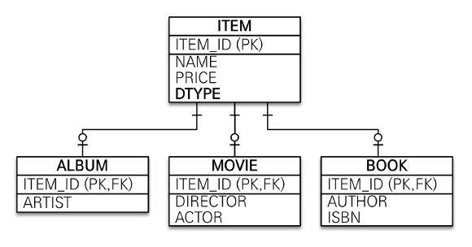
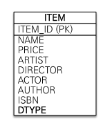
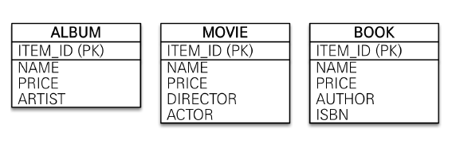
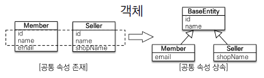

#고급 매핑


## 1. 상속관계 매핑
- 관계형 DB에는 객체지향 언어에서 다루는 속성이라는 개념이 없다.
- 대신 슈퍼타입과 서브타입 관계라는 모델링 기법이 객체의 상속 개념과 가장 유사하다.
- ORM에서 이야기하는 상속 관계 매핑은 객체의 상속 구조와 DB의 슈퍼타입 서브타입 관계를 매핑하는 것이다.

### 1.1 조인 전략

- 조인 전략은 엔티티 각각을 모두 테이블로 만들고 자식 테이블이 부모 테이블의 기본 키를 받아서 기본 키 + 외래 키로 사용하는 전략이다.
- 주의 사항으로 테이블은 타입 개념이 없기 때문에 타입을 구분하는 컬럼을 추가해야 한다.

#### Item.java
```java
@Entity
@Inheritance(strategy = InheritanceType.JOINED)
@DiscriminatorColumn(name = "DTYPE")            // 자식 테이블을 구분할 수 있는 구분 컬럼 지정
public abstract class Item {

    @Id @GeneratedValue
    @Column(name = "ITEM_ID")
    private Long id;
    
    private String name;
    private Long price;
}
```

#### Album.java
```java
@Entity
@DiscriminatorValue("A")                        // 엔티티를 저장할 때 구분 컬럼에 입력할 값 지정
public class Album extends Item {

    private String artist;
}
```

#### Movie.java
```java
@Entity
@DiscriminatorValue("M")
public class Movie extends Item {

    private String director;
    private String actor;
}
```

#### Book.java
```java
@Entity
@DiscriminatorValue("B")
@PrimaryKeyJoinColumn(name = "BOOK_ID")     // 자식 테이블의 ID 컬럼명 재정의
public class Book extends Item {

    private String author;
    private String isbn;
}
```

- 장점
    - 테이블이 정규화된다
    - 외래 키 참조 무결성 제약 조건을 활용할 수 있다.
    - 저장공간을 효율적으로 사용한다.
- 단점
    - 조회할 때 조인이 많이 사용되므로 성능이 저하될 수 있다.
    - 조회 쿼리가 복잡하다
    - 데이터를 등록할 INSERT 쿼리가 두 번 실행한다. (부모 테이블 한 번, 자식 테이블 한 번)
    
### 1.2 단일 테이블 전략

- 단일 테이블 전략은 테이블을 하나만 사용하는 전략이다.
- 반드시 구분 컬럼으로 어떤 자식 데이터가 저장되었는지 구분해주어야 한다.

#### Item.java
```java
@Inheritance(strategy = InheritanceType.SINGLE_TABLE)
```

- 장점
    - 조인이 필요 없으므로 일반적으로 조회 성능이 빠르다.
    - 조회 쿼리가 단순하다.
- 단점
    - 자식 엔티티가 매핑한 컬럼은 모두 null을 허용해야 한다.
    - 단일 테이블에 모든 것을 저장하므로 테이블이 커질 수 있다. 그러므로 상황에 따라서는 조회 성능이 오히려 느려질 수 있다.
    
### 1.3 구현 클래스마다 테이블 전략

- 구현 클래스마다 테이블 전략은 자식 엔티티마다 테이블을 만드는 전략이다.
- 자식 테이블 각각에 필요한 컬럼이 모두 있다. 그러므로 구분 컬럼을 사용하지 않는다.
- **일반적으로 추천하지 않는 전략이다.**

#### Item.java
```java
@Inheritance(strategy = InheritanceType.TABLE_PER_CLASS)
```

- 장점
    - 서브 타입을 구분해서 처리할 때 효과적이다.
    - not null 제약조건을 사용할 수 있다.
- 단점    
    - 여러 자식 테이블을 함께 조회할 때 성능이 느리다.
      - 부모타입의 자식 테이블에 해당하는 모든 테이블들을 UNION하여 조회하기 때문에 성능이 심각하게 떨어진다.
    - 자식 테이블을 통합해서 쿼리하기 어렵다.


## 2. @MappedSuperclass

- 부모 클래스는 테이블과 매핑하지 않고 부모 클래스를 상속받는 자식 클래스에게 매핑 정보만 제공하고 싶을 때 사용한다.

#### BaseEntity.java
```java
@MappedSuperclass
public class BaseEntity {

    private String createdBy;
    private LocalDateTime createDate;
    private String lastModifiedBy;
    private LocalDateTime lastModifiedDate;
}
```

#### Member.java
```java
@Entity
public class Member extends BaseEntity {
    
    @Id @GeneratedValue
    private Long id;
    
    private String name;
}
```

#### SQL
```sql
create table Member
(
  id               bigint not null,
  createDate       timestamp,
  createdBy        varchar(255),
  lastModifiedBy   varchar(255),
  lastModifiedDate timestamp,
  name             varchar(255),
  primary key (id)
)
```

- 테이블과 매핑되지 않고 자식 클래스에 엔티티의 매핑 정보를 상속하기 위해 사용한다.
- @MappedSuperClass로 지정한 클래스는 엔티티가 아니므로 em.find()나 JPQL에서 사용할 수 없다.
- 이 클래스를 직접 사용할 일이 거의 없기 때문에 추상 클래스로 만드는 것을 권장한다.

---
### Reference
- [자바 ORM 표준 JPA 프로그래밍](https://www.inflearn.com/course/ORM-JPA-Basic)