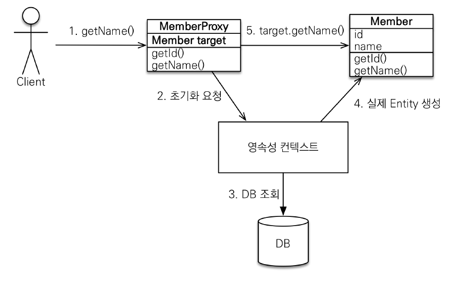

# 프록시와 연관관계 관리


## 1. 프록시
- 엔티티를 조회할 때 연관된 엔티티들이 항상 사용되는 것은 아니다.
- `find()` 메서드를 사용하면 DB에서 실제 엔티티 객체를 조회하기 때문에 항상 연관된 엔티티들까지 같이 조회한다. 
- 이러한 효율성이 떨어지는 문제를 해결하기 위해 JPA에서는 프록시와 지연 로딩을 사용한다.

### 1.1 프록시 기초
- 엔티티를 실제 사용하는 시점까지 DB 조회를 미루고 싶으면 `getReference()` 메서드를 사용하면 된다.
- `getReference()` 메서드를 호출하면 실제 엔티티 객체를 생성하지 않고, 대신 DB 접근을 위임한 프록시 객체를 반환한다.



- 프록시 클래스는 실제 클래스를 상속 받아서 만들어지기 때문에 실제 클래스와 겉모양이 같다.
- 프록시 객체는 실제 객체에 대한 참조(target)을 보관하며, 프록시 객체의 메소드를 호출하면 프록시 객체는 실제 객체의 메소드를 호출한다.
- 프록시 객체는 실제 사용될 때 DB를 조회해서 실제 엔티티 객체를 생성하는데 이것을 **프록시 객체의 초기화**라 한다.

### 1.2 프록시 특징
- 프록시 객체는 처음 사용할 때 한 번만 초기화 된다.

#### Application.java
```java
Member refMember = em.getReference(Member.class, member.getId());
System.out.println("before refMember = " + refMember.getClass());         // HibernateProxy
System.out.println("refMember.username = " + refMember.getUsername());
System.out.println("after refMember = " + refMember.getClass());          // HibernateProxy
```

- 프록시 객체를 초기화 할 때 프록시 객체가 실제 엔티티로 바뀌는 것은 아니다. 프록시 객체가 초기화 되면 프록시 객체를 통해서 실제 엔티티에 접근할 수 있다.

#### Application.java
```java
Member member = em.find(Member.class, member.getId());
Member refMember = em.getReference(Member.class, member.getId());
System.out.println(member.getClass() == refMember.getClass());     // false
System.out.println(member instanceof Member);               // true
System.out.println(refMember instanceof Member);               // true
```
  
- 프록시 객체는 원본 엔티티를 상속받은 객체이므로 타입 체크시에 주의해서 사용해야 한다.
    - `==` 대신 `instanceof`를 이용하여 타입 비교를 하자.

#### Application.java
```java
Member member = em.find(Member.class, member.getId());
Member refMember = em.getReference(Member.class, member.getId());
System.out.println(member.getClass());  //class hellojpa.Member
System.out.println(refMember.getClass());  //class hellojpa.Member
```

- 영속성 컨텍스트에 찾는 엔티티가 이미 있으면 DB를 조회할 필요가 없으므로, `getReference()`를 호출해도 프록시가 아닌 실제 엔티티를 반환한다.

#### Application.java
```java
Member refMember = em.getReference(Member.class, member.getId());
Member member = em.getfind(Member.class, member.getId());
System.out.println(refMember.getClass());  //class hellojpa.Member$HibernateProxy
System.out.println(member.getClass());  //class hellojpa.Member$HibernateProxy
```

- 반대로 `getReference()`를 호출한 뒤 `find()`로 실제 엔티티를 조회하면 프록시 객체가 반환된다.
  - 하나의 트랜잭션에서 조회한 두 엔티티의 동일성을 보장하기 위해서 위와 같이 동작한다.

#### Application.java
```java
Member refMember = em.getReference(Member.class, member.getId());

em.detach(refMember)
        
proxy.getName();    // org.hibernate.LazyInitializationException 예외 발생
```

- 영속성 컨텍스트의 도움을 받을 수 없는 준영속 상태의 프록시를 초기화하면 문제가 발생한다.(LazyInitioalizationException)

### 1.3 프록시 확인
#### Application.java
```java
Member refMember = em.getReference(Member.class, member.getId());
System.out.println(emf.getPersistenceUnitUtil().isLoaded(refMember)); //false
        
hibernate.initialize(refMember);    // 프록시 강제 초기화

System.out.println(emf.getPersistenceUnitUtil().isLoaded(refMember)); //true
```

- `getPersistenceUnitUtil().isLoaded()` 메서드를 사용하여 프록시 인스턴스의 초기화 여부를 확인할 수 있다.
- 초기화되지 않은 프록시 인스턴스는 false를, 이미 초기화되었거나 프록시 인스턴스가 아니면 true를 반환한다.


## 2. 즉시 로딩과 지연로딩
### 2.1 즉시 로딩
#### Member.java
```java
@Entity
public class Member {
    //...
    @ManyToOne(fetch = FetchType.EAGER)
    @JoinColumn(name = "TEAM_ID")
    private Team team;
    //...
}
```

#### Application.java
```java
Member member = em.find(Member.class, "member1");
Team team = member.getTeam();   // 객체 그래프 탐색
```

#### SQL
```sql
SELECT 
    M.MEMBER_ID AS MEMBER_ID,
    M.TEAD_ID AS TEAM_ID,
    M.USERNAME AS USERNAME,
    T.TEAD_ID AS TEAM_ID,
    T.NAME AS NAME 
FROM
    MEMBER M LEFT OUTER JOIN TEAM T 
        ON M.TEAM_ID=T.TEAM_ID
WHERE
    M.MEMBER_ID='member1'
```

- 즉시 로딩은 엔티티를 조회할 때 연관된 엔티티도 함께 조회한다.
- 위 코드를 보면 `em.find(Member.class, "member1")`로 Member를 조회한 순간 Team도 함께 조회하였다.
- 이 때 JPA 구현체는 즉시 로딩을 최적화하기 위해 가능하면 조인 쿼리를 사용한다.

#### 2.1.1 NULL 제약조건과 JPA 조인 전략  
- JPA는 FK가 null 값을 허용한다면 위 SQL문처럼 외부 조인(LEFT OUTER JOIN)을 사용한다.
  - FK에 null 값이 들어있는 데이터도 검색할 수 있기 때문이다.
- 반대로 JPA에게 FK에 null 값을 허용하지 않는다고 알려주면 내부 조인을 사용한다.
- 내부 조인이 외부 조인보다 성능과 최적화에서 더 유리하기 때문에 아래 두가지 최적화 방법을 알고 있어야 한다.

#### Member.java
```java
@Entity
public class Member {
    //...
    @ManyToOne(fetch = FetchType.EAGER)
    @JoinColumn(name = "TEAM_ID", nullable = false)
    private Team team;
    //...
}
```

#### Member.java
```java
@Entity
public class Member {
    //...
    @ManyToOne(fetch = FetchType.EAGER, optional = false)
    @JoinColumn(name = "TEAM_ID")
    private Team team;
    //...
}
```

### 2.2 지연 로딩
#### Member.java
```java
@Entity
public class Member {
    //...
    @ManyToOne(fetch = FetchType.LAZY)
    @JoinColumn(name = "TEAM_ID")
    private Team team;
    //...
}
```

#### Application.java
```java
Member member = em.find(Member.class, "member1");
Team team = member.getTeam();   // 객체 그래프 탐색 (프록시 객체 반환)
team.getName();                 // 팀 객체 실제 사용
```

#### SQL
```sql
SELECT * FROM MEMBER
WHERE MEMBER_ID = 'member1'
```

#### SQL
```sql
SELECT * FROM TEAM
WHERE TEAM_ID = 'team1'
```

- 지연 로딩은 연관된 엔티티를 실제 사용할 때 조회한다.
- 객체가 실제 사용될 때 DB를 조회하면서 프록시 객체를 초기화 한다.
  - 따라서 위의 예시에서는 SELECT 쿼리가 두번 나간다.

### 2.3 주의점
- 실무에서는 대부분의 경우에 지연 로딩만 사용하는 것을 추천한다.
- 즉시 로딩을 적용하면 예상치 못한 SQL이 발생하여 성능 문제를 일으킨다. (대표적으로 JPQL에서 N+1 문제)
- @OneToMany, @ManyToMany는 기본이 지연 로딩이라 문제 없다.
- 그러나 **@ManyToOne, @OneToOne은 기본이 즉시 로딩이기 때문에** 반드시 지연 로딩으로 변경해주어야 한다.


## 3. 영속성 전이: CASCADE
#### Parent.java
```java
@Entity
public class Parent {

    @Id
    @GeneratedValue
    private Long id;
    
    @OneToMany(mappedBy = "parent")
    private List<Child> childList = new ArrayList<>();

    public void addChild(Child child) {
        childList.add(child);
        child.setParent(this);
    }
}
```

#### Child.java
```java
@Entity
public class Child {

    @Id
    @GeneratedValue
    private Long id;
    
    @ManyToOne
    @JoinColumn(name = "PARENT_ID")
    private Parent parent;
}
```

#### Applicattion.java
```java
Parent parent = new Parent();
Child child1 = new Child();
Child child2 = new Child();

parent.addChild(child1);
parent.addChild(child2);

em.persist(child1);
em.persist(child2);
em.persist(parent);
```

- JPA에서 엔티티를 저장할 때 연관된 모든 엔티티는 영속 상태여야 한다.
- 따라서 예제와 같이 Child에 대해서도 전부 영속화시켜야 한다는 불편함이 있다.

#### Parent.java
```java
@Entity
public class Parent {
    //...
    @OneToMany(mappedBy = "parent", cascade = CascadeType.PERSIST)
    private List<Child> childList = new ArrayList<>();
    //...
}
```

#### Application.java
```java
Parent parent = new Parent();
Child child1 = new Child();
Child child2 = new Child();

parent.addChild(child1);    // 연관관계 추가
parent.addChild(child2);    // 연관관계 추가

em.persist(parent);         // 부모와 연관된 자식들 저장
```

- 위 코드와 같이 cascade 속성을 통해 엔티티를 영속화 할 때 연관된 엔티티도 같이 영속화 시킬 수 있다.
- 연관관계와 매핑하는 것과는 아무 관련이 없다.
- 옵셥은 ALL(모두 적용), PERSIST(영속), REMOVE(삭제) 등이 있다.
- PERSIST와 REMOVE 옵션은 플러시를 호출할 때 전이가 발생한다.


## 4. 고아 객체
#### Parent.java
```java
@Entity
public class Parent {
  //...
  @OneToMany(mappedBy = "parent", orphanRemoval = true)
  private List<Child> childList = new ArrayList<>();
  //...
}
```

#### Application.java
```java
Parent parent1 = em.find(Parent.class, parent.getId());
parent1.getChildList().remove(0);
```

- 고아 객체 제거는 부모 엔티티와 연관관계가 끊어진 자식 엔티티를 자동으로 삭제하는 기능이다.
- 자식 엔티티를 컬렉션에서 제거하면 자동으로 해당 자식 엔티티에 대한 DELETE 쿼리가 나간다.

### 4.1 주의점
- 특정 엔티티가 개인 소유하는 엔티티에만 이 기능을 적용해야 한다.
  - @OneToOne, @OneToMany와 같이 참조하는 곳이 하나일 때만 사용해야 한다.
- CascadeType.REMOVE를 설정한 것과 같다.

### 생명 주기
- CascadeType.ALL + orphanRemoval = true를 동시에 사용하면 어떻게 될까?
- 두 옵션을 모두 활성화 하면 부모 엔티티를 통해서 자식의 생명주기를 관리할 수 있다.
- 즉 자식을 저장하려면 부모에 등록하면되고, 자식을 삭제하려면 부모에서 제거하면 된다.
- 도메인 주도 설계(DDD)의 Aggregate Root개념을 구현할 때 사용하면 편리하다.
