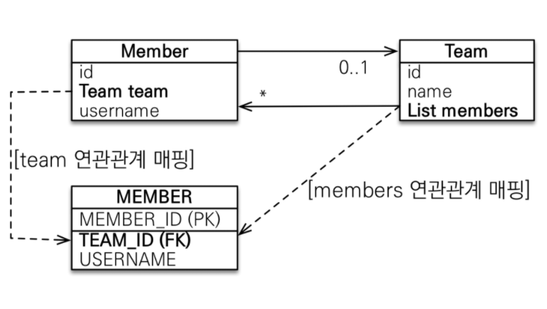

# 연관관계 매핑 기초

## 1. 단방향 연관관계

#### Member.java
```java

@Entity
public class Member {

    @Id
    @Column(name = "MEMBER_ID")
    @GeneratedValue
    private Long id;

    private String name;

    // 연관관계 매핑
    @ManyToOne                      // 다대일(N:1) 관계라는 매핑 정보
    @JoinColumn(name = "TEAM_ID")   // 외래키를 매핑할 때 사용
    private Team team;

    // 연관관계 설정
    public void setTeam(Team team) {
        this.team = team;
    }
}
```

#### Team.java
```java

@Entity
public class Team {

    @Id
    @Column(name = "TEAM_ID")
    @GeneratedValue
    private Long id;

    private String name;
}
```

- Member와 Team은 다대일(N:1) 관계를 형성한다.
- Member에서 `@JoinColumn`을 통해 다른 엔티티 테이블의 어떤 컬럼과 조인하는지 참조 FK(외래키)
  를 명시한다.

#### Application.java
```java
// 팀 저장
Team team = new Team();
team.setName("TeamA");
em.persist(team);

// 멤버 저장
Member member = new Member();
member.setName("member1");
member.setTeam(team);
em.persist(member);

// 조회
Member findMember = em.find(Member.class,3L);
Team findTeam = findMember.getTeam();
```

- 객체 그래프 탐색을 통해 참조로 자유롭게 연관 관계를 조회한다.
- setter를 통해 Member의 Team을 수정하면 커밋 시점에 참조하는 Team 테이블의 ID PK가 변경된다.


## 2. 양방향 연관관계

#### Team.java
```java

@Entity
public class Team {

    @Id
    @Column(name = "TEAM_ID")
    @GeneratedValue
    private Long id;

    private String name;

    @OneToMany(mappedBy = "team")                         // 일대다(1:N) 관계라는 매핑정보
    private List<Member> members = new ArrayList<>();     // Team에서 Member 객체 그래프 탐색 가능
}
```

#### Application.java
```java
Team team = em.find(Team.class, "team");
List<Member> members = team.getMembers();

for(Member member:members){
System.out.println("member.username = " + member.getUsername());
}
```

- Team에서 Member 컬렉션으로 객체 그래프를 탐색할 수 있다.

### 2.1 연관관계의 주인

- 테이블은 외래키 하나로 두 테이블의 연관관계를 관리한다.
- 객체는 양방향 연관관계라는 것이 없다. 서로 다른 단방향 연관관계 두개를 어플리케이션 로직으로 잘 묶어서 양방향인 것 처럼 보이게 하는 것이다.
- 따라서 엔티티를 양방향 연관관계로 설정하면, 객체의 참조는 둘인데 외래 키는 하나가 된다.
- 이런 차이로 인해서 JPA에서는 두 객체 연관관계 중 하나를 정해서 테이블의 외래키를 관리하게 하는데, 이를 **연관관계의 주인**이라고 한다.
- 연관관계의 주인만이 DB 연관관계와 매핑되고 외래키를 관리(등록, 수정, 삭제)할 수 있다.
- **주인이 아닌 쪽은 읽기만 할 수 있다.**

- 주인은 `mappedBy` 속성을 사용하지 않으며, 주인이 아니면 `mappedBy` 속성으로 주인을 지정해야 한다.

- **다대일(N:1), 일대다(1:N) 매핑의 경우 항상 `다` 쪽이 FK를 가진다.**
    - 1쪽이 FK를 가지게 된다면, 1 엔티티를 수정했을 때, 다 테이블에 쿼리가 날아가게 되어 직관적이지 않다.

### 2.2 양방향 연관관계의 주의점
#### Application.java
```java
Team team = new Team();
team.setName("TeamA");
em.persist(team);
        
Member member = new Member();
member.setName("member1");
team.getMembers().add(member);
em.persist(member);
```
- DB를 조회하는 경우 Member 테이블의 TEAM_ID는 null이다.
- 역방향만 연관 관계를 설정하고 연관관계의 주인에 값을 입력하지 않았기 때문이다.
- 영속화 전에 `member.setTeam(team);`을 호출해야한다.

#### Application.java
```java
Team team = new Team();
team.setName("black team");
em.persist(team);

Member member = new Member();
member.setName("abc");
member.setTeam(team);
//team.getMembers().add(member);
em.persist(member);

//만약 여기서 flush, clear 등을 호출한다면 isEmpty()는 false다

Member findMember = em.find(Member.class, member.getId());
System.out.println(findMember.getTeam().getMembers().isEmpty());     //true
```

- Team과 Member는 `persist()`를 통해 영속성 컨텍스트의 1차 캐시에 존재한다. 따라서 Member 조회를 요청하면 실제 DB가 아니라 1차 캐시에서 가져온다.
- 영속화 전에 `team.getMembers().add(member);`를 호출하지 않아 역방향 조회시 컬렉션이 비어있다.
  

- 만약 Member 조회 이전에 영속성 컨텍스트를 초기화한 상태라면 위 경우 DB에서 새로 Member를 조회하기 때문에 문제가 되지 않는다.
- 지연 로딩을 사용하기 때문에 `findMember.getTeam().getMembers()` 호출을 통해 실제 Team 엔티티 내부의 컬렉션 객체가 필요한 순간 JOIN SELECT 쿼리가 날아간다.

#### Team.java
```java
public void setTeam(Team team) {
    
    // 기존의 연관관계를 제거
    if (this.team != null) {
        this.team.getMembers().remove(this);
    }
    
    this.team = team;
    team.getMembers().add(this);
}
```

- 결론은 객체의 양방향 연관관계는 양쪽 모두 관계를 맺어주는 것이 좋다.
- 따라서 위 코드와 같이 두 코드가 하나인 것처럼 사용하는 것이 안전하다.
- 양방향 매핑시 무한 루프에 빠지지 않게 조심해야 한다. `toString()`을 주의하자.