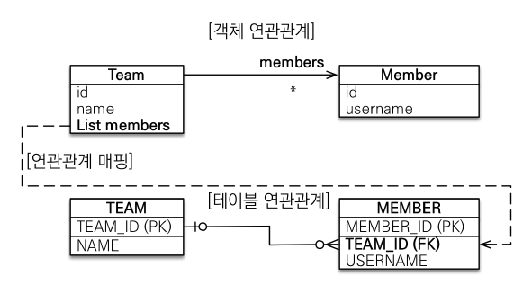
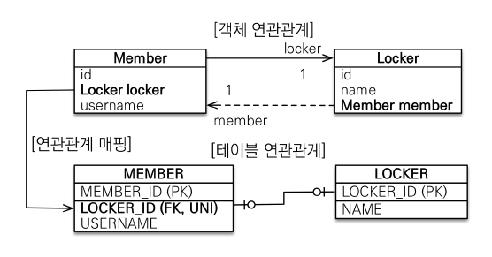

# 다양한 연관관계 매핑


## 1. 다대일(N:1)
- 다대일의 반대 방향은 항상 일대다 관계고 일대다 관계의 반대 방향은 항상 다대일 관계다.
- DB 테이블의 일, 다 관계에서 외래 키는 항상 '다' 쪽에 있다.
- 따라서 객체 양방향 관계에서 연관관계의 주인은 항상 '다' 쪽이다.

### 1.1 다대일 단방향


#### Member.java
```java
@Entity
public class Member {

    @Id @GeneratedValue
    @Column(name = "MEMBER_ID")
    private Long id;
    
    private String username;
    
    @ManyToOne
    @JoinColumn(name = "TEAM_ID")
    private Team team;
}
```

#### Team.java
```java
@Entity
public class Team {

    @Id @GeneratedValue
    @Column(name = "TEAM_ID")
    private Long id;
    
    private String name;
}
```

### 1.2 다대일 양방향


#### Member.java
```java
@Entity
public class Member {

    @Id @GeneratedValue
    @Column(name = "MEMBER_ID")
    private Long id;
    
    private String username;
    
    @ManyToOne
    @JoinColumn(name = "TEAM_ID")
    private Team team;
    
    public void setTeam(Team team) {
        this.team = team;
        
        // 무한루프를 방지하기 위해 체크
        if (!team.getMembers().contains(this)) {
            team.getMembers().add(this);
        }
    }
}
```

#### Team.java
```java
@Entity
public class Team {

    @Id @GeneratedValue
    @Column(name = "TEAM_ID")
    private Long id;
    
    private String name;

    @OneToMany(mappedBy = "team")
    private List<Member> members = new ArrayList<>();
    
    public void addMember(Member member) {
        this.members.add(member);

        // 무한루프를 방지하기 위해 체크
        if (member.getTeam() != this) {
            member.setTeam(this);
        }
    }
}
```
- Member의 `setTeam()`, Team의 `addMember()`과 같은 메서드는 항상 서로 참조하도록 만들어둔 편의 메서드이다.
- 양쪽 다 편의 메소드를 작성할 시 무한루프에 빠질 수 있기 때문에, 이를 방지하는 코드가 필요하다.


## 2. 일대다(1:N)
- 일대다 관계는 엔티티를 하나 이상 참조할 수 있으므로, 자바 컬렉션인 Collection, List, Set, Map 중에 하나를 사용해야 한다.

### 2.1 일대다 단방향


#### Team.java
```java
@Entity
public class Team {

    @Id @GeneratedValue
    @Column(name = "TEAM_ID")
    private Long id;
    
    private String name;
    
    @OneToMany
    // Member 테이블의 Team_ID (FK)
    @JoinColumn(name = "TEAM_ID")
    private List<Member> members = new ArrayList<Member>();
}
```

#### Memeber.java
```java
@Entity
public class Member {

    @Id @GeneratedValue
    @Column(name = "MEMBER_ID")
    private Long id;
    
    private String username;
}
```
- @JoinColumn을 반드시 사용해야 하며, 그렇지 않으면 중간에 테이블을 하나 추가하는 조인 테이블 방식을 사용한다.

#### Application.java
```java
Member member1 = new Member("member1");

Team team1 = new Team("team1");
team1.getMembers().add(member1);

em.persist(member1);    // INSERT-member1
em.persist(team1);      // INSERT-team1, UPDATE-member1.fk

tx.commit();
```

- 일대다 단방향 매핑의 단점은 매핑한 객체가 관리하는 외래 키가 다른 테이블에 있다는 점이다.
- 다른 테이블에 외래 키가 있기 때문에, 위와 같이 연관관계 처리를 위한 UPDATE 쿼리가 추가로 실행된다.
- 따라서 일대다 단방향 매핑 대신 **다대일 양방향 매핑 사용이 권장된다.**

### 2.2 일대다 양방향


#### Team.java
```java
@Entity
public class Team {

    @Id @GeneratedValue
    @Column(name = "TEAM_ID")
    private Long id;
    
    private String name;
    
    @OneToMany
    // Member 테이블의 Team_ID (FK)
    @JoinColumn(name = "TEAM_ID")
    private List<Member> members = new ArrayList<Member>();
}
```

#### Member.java
```java
@Entity
public class Member {

    @Id @GeneratedValue
    @Column(name = "MEMBER_ID")
    private Long id;
    
    private String username;
    
    @ManyToOne
    @JoinColumn(name = "TEAM_ID", insertable = false, updatable = false)
    private Team team;
}
```

- 일대다 양방향 매핑은 JPA에서 공식적으로 지원하지 않는다.
- 관계형 DB의 특성상 일대다, 다대일 관계는 항상 '다' 쪽에 외래키가 있어 연관관계의 주인은 항상 '다' 쪽인 @ManyToOne을 사용한 곳이 된다.
- 그리고 @ManyToOne은 `mappedBy` 속성이 없다.
- 따라서 위 코드처럼 일대다 단방향 매핑 반대편에 다대일 단방향 매핑을 읽기 전용으로 추가해서 일대다 양방향처럼 보기도록 할 수 있다.
- 그러나 일대다 단방향 매핑이 가지는 단점을 그대로 가지기 때문에, 가능하면 다대일 양방향 매핑을 사용하자.


## 3. 일대일(1:1)
- 일대일 관계는 그 반대도 일대일 관계다.
- 따라서 **일대일 관계는 주 테이블이나 대상 테이블 둘 줄 어느 곳이나 외래 키를 가질 수 있다.**

### 3.1 주테이블에 외래키 단방향


#### Member.java
```java
@Entity
public class Member {

    @Id @GeneratedValue
    @Column(name = "MEMBER_ID")
    private Long id;
    
    private String username;
    
    @OneToOne
    @JoinColumn(name = "LOCKER_ID")
    private Locker locker;
}
```

#### Locker.java
```java
@Entity
public class Locker {

    @Id @GeneratedValue
    @Column(name = "LOCKER_ID")
    private Long id;
    
    private String name;
}
```
- DB LOCKER_ID 외래 키에 유니크 제약 조건(UNI)를 추가했다.
- 다대일 단방향과 거의 비슷하다.

### 3.2 주테이블에 외래키 양방향


#### Member.java
```java
@Entity
public class Member {

    @Id @GeneratedValue
    @Column(name = "MEMBER_ID")
    private Long id;
    
    private String username;
    
    @OneToOne
    @JoinColumn(name = "LOCKER_ID")
    private Locker locker;
}
```

#### Locker.java
```java
@Entity
public class Locker {

    @Id @GeneratedValue
    @Column(name = "LOCKER_ID")
    private Long id;
    
    private String name;
    
    @OneToOne(mappedBy = "locker")
    private Member member;
}
```

### 3.3 대상 테이블에 외래키 단방향

- 대상 테이블에 외래 키가 있는 단방향 관계는 JPA에서 지원하지 않으며, 이런 모양으로 매핑할 수 있는 방법도 없다.

### 3.4 대상 테이블에 외래키 양방향


#### Member.java
```java
@Entity
public class Member {

    @Id @GeneratedValue
    @Column(name = "MEMBER_ID")
    private Long id;
    
    private String username;
    
    @OneToOne(mappedBy = "member")
    private Locker locker;
}
```

#### Locker.java
```java
@Entity
public class Locker {

    @Id @GeneratedValue
    @Column(name = "LOCKER_ID")
    private Long id;
    
    private String name;
    
    @OneToOne(mappedBy = "locker")
    @JoinColume(name = "MEMBER_ID")
    private Member member;
}
```
- 일대일 주 테이블에 외래키 양방향과 매핑 방법은 같다.
- 따라서 미래의 비즈니스 로직 변경 여부를 고려하여 어느쪽에 외래키가 위치하는 것이 유리한지 고민해봐야 한다.

### 3.5 각 방법의 장단점
- 주 테이블에 외래키
  - 장점: 주 테이블만 조회해도 대상 테이블에 데이터가 있는지 확인할 수 있다.
  - 단점: 값이 없으면 외래키에 null값을 허용한다.
- 대상 테이블에 외래키
  - 장점: 주 테이블과 대상 테이블을 일대일에서 일대다 관계로 변경할 때 테이블 구조를 유지할 수 있다.
  - 단점: 프록시 기능의 한계로 지연 로딩으로 설정해도 항상 즉시 로딩된다.  
    

## 4. 다대다(N:N)

- 관계형 DB는 정규화된 테이블 2개로 다대다 관계를 표현할 수 없다.
- 보통 다대다 관계를 일대다, 다대일 관계로 풀어내는 연결 테이블을 추가하여 사용한다.


- 실제 실무에서는 다대다 관계를 사용하기 어렵다.
- 실무에서는 두 테이블을 연결할 때, 연결 테이블이 단순히 연결만 하지 않고 다양한 비즈니스 관련 데이터가 들어오는 일이 빈번하다.
- @ManyToMany로 생성하는 연결 테이블에는 비즈니스 관련 데이터로 인해 추가한 컬럼들을 매핑할 수 없다.  
- 이런 문제가 있기 때문에 연결 테이블을 엔티티로 승격시켜 한계를 극복한다.

#### Order.java
```java
@Entity
public class Order {
    
    @Id @GeneratedValue
    @Column(name = "ORDER_ID")
    private Long id;

    @ManyToOne
    @JoinColume(name = "MEMBER_ID")
    private Member member;

    @ManyToOne
    @JoinColume(name = "PRODUCT_ID")
    private Product product;
    
    private int orderAmount;
}
```

#### Member.java
```java
@Entity
public class Member {
    
    @Id @Column(name = "MEMBER_ID")
    private String id;
    private String username;
    
    @OneToMany(mappedBy = "member")
    private List<Order> orders = new ArrayList<Order>();
}
```

#### Product.java
```java
@Entity
public class Product {
    
    @Id @Column(name = "PRODUCT_ID")
    private String id;
    private String name;
}
```

- 연결 테이블 PK는 비즈니스 로직 의미가 없는 값으로 자동 생성되도록 한다.
- 복합 기본키를 사용하면 MEMBER_ID와 PRODUCT_ID 가 모두 PK와 FK로 잡혀있어 커플링이 심하다. 이는 차후 시스템 과정에서 어려움을 야기할 수 있다.
- 따라서 추천하는 기본 키 생성 전략은 DB에서 자동으로 생성해주는 대리 키를 Long값으로 사용하는 것이다.
- 위 예시처럼 ORDER_ID라는 새로은 기본 키를 하나 만들고, MEMBER_ID, PRODUCT_ID 컬럼은 외래 키로만 사용한다.

---
### Reference
- [자바 ORM 표준 JPA 프로그래밍](https://www.inflearn.com/course/ORM-JPA-Basic)